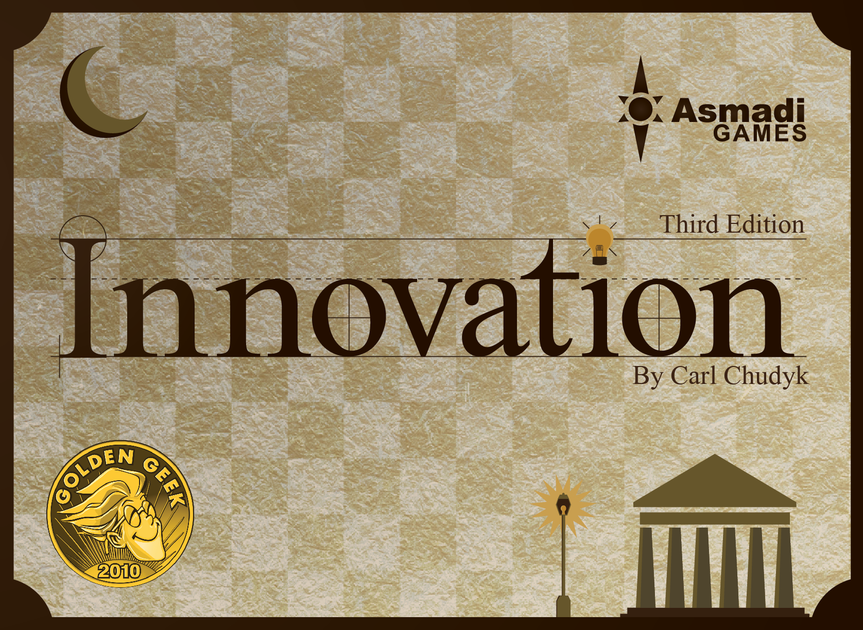

# Innovation

A virtual version of the [board game](http://asmadigames.com/files/InnovationRules.pdf)

## To run

1. Fork & clone repo
2. Run: `npm start` to build with webback-dev-server

## Required keys

You'll need the following keys in a .env file:

- `NODE_ENV`: (development || production)
- `REACT_APP_FIREBASE_CONFIG`: (path-to-firebase-config) -> NOTE: this should be scoped within the `src` dir and relative to the `src/utils/firebase.js` file which requires this config to connect to the firebase firestore.

## Built with

- [Create React App](https://create-react-app.dev/)
- [React-Redux](https://react-redux.js.org/)
- [Styled-Components](https://styled-components.com/)
